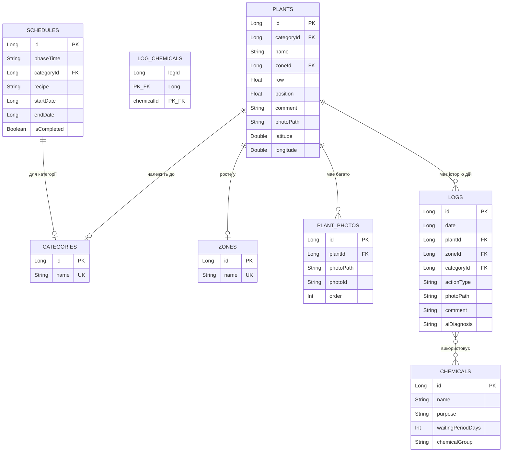

# Документація застосунку «Розумний Сад» (Fazenda App)

Застосунок **«Розумний Сад»** — це сучасний та зручний мобільний помічник для дачників, садівників та фермерів, який поєднує в собі функції каталогу рослин, планувальника догляду, інтерактивної карти ділянки та журналу подій з елементами інтеграції штучного інтелекту (ШІ) та прогнозу погоди.

Проєкт реалізовано на мові **Kotlin** з використанням сучасного стека розробки під Android: **Jetpack Compose** для інтерфейсу, **Room** для бази даних, **OsmDroid** для мап та **Coroutines/Flow** для асинхронної роботи.

---

## 📂 Структура проєкту

Проєкт має чітко розділену архітектуру (MVVM):

```
Fazenda_app_android/
├── .ai/AGENTS.md                ← Інструкції для AI-агентів (джерело правди)
├── tasks.md                     ← Черга задач на розробку
├── DOCUMENTATION.md             ← Цей файл — архітектура та функціонал
├── README.md                    ← Швидкий старт, build, release
├── build-release.ps1            ← Скрипт збірки + публікації
├── .env                         ← KEYSTORE_PASSWORD (в .gitignore)
├── .github/workflows/release.yml ← CI/CD GitHub Actions
├── gradle/libs.versions.toml    ← Централізовані версії бібліотек
│
└── app/
    ├── build.gradle.kts         ← Android-конфіг, signingConfigs
    ├── version.properties       ← VERSION_CODE=46, VERSION_NAME=1.0.36
    ├── fazenda-keystore.jks     ← Ключ підпису (в .gitignore)
    └── src/main/
        ├── AndroidManifest.xml  ← Permissions, FileProvider, NotificationReceiver
        ├── assets/images/       ← Вбудовані фото рослин (seed)
        ├── res/raw/             ← CSV файли для первинного seeding БД
        └── java/com/fazenda/app/
            ├── FazendaApplication.kt  ← Application singleton (DI, auto-backup)
            ├── MainActivity.kt        ← Single Activity (Compose host)
            ├── data/                  ← Рівень даних
            │   ├── database/AppDatabase.kt ← Room DB v10, migrations, seeding
            │   ├── dao/               ← 7 DAO-інтерфейсів
            │   ├── entity/            ← 10 Room entity файлів
            │   ├── repository/        ← 7 репозиторіїв
            │   └── util/CsvParser.kt  ← CSV парсер
            ├── service/               ← 9 сервісних класів
            └── ui/                    ← Рівень представлення
                ├── navigation/AppNavigation.kt
                ├── theme/Theme.kt
                ├── component/         ← 3 спільних компоненти
                ├── util/PhotoPathResolver.kt
                ├── viewmodel/         ← 12 ViewModel
                └── screen/            ← 7 screen-пакетів (16 файлів)
```

---

## 🔧 Технологічний стек

| Категорія | Бібліотека | Версія |
|-----------|-----------|--------|
| Мова | Kotlin | 2.0.21 |
| Android Gradle Plugin | AGP | 8.7.2 |
| UI | Jetpack Compose BOM | 2024.06.00 |
| Design | Material 3 | (з BOM) |
| Навігація | Navigation Compose | 2.7.7 |
| БД | Room | 2.7.0 |
| Камера | CameraX | 1.5.0 |
| Зображення | Coil Compose | 2.6.0 |
| Карти | OsmDroid | 6.1.18 |
| Async | Kotlinx Coroutines | 1.8.1 |
| Lifecycle | Lifecycle Runtime/ViewModel | 2.8.2 |
| KSP | KSP (Room compiler) | 2.0.21-1.0.28 |

**Android targets**: `minSdk = 26`, `targetSdk = 35`, `compileSdk = 35`, `JVM = 17`

---

## 💾 Схема бази даних (Room)

**Database**: `fazenda_db`, **version = 10**, **exportSchema = false**

### Сутності

| Entity | Таблиця | Ключові поля | Зв'язки |
|--------|---------|-------------|---------|
| `PlantEntity` | `plants` | id, name, categoryId, zoneId, row, position, photoPath, latitude, longitude, comment | FK → categories, FK → zones |
| `CategoryEntity` | `categories` | id, name (UNIQUE) | — |
| `ZoneEntity` | `zones` | id, name (UNIQUE) | — |
| `PlantPhotoEntity` | `plant_photos` | id, plantId, photoPath, photoId, order | FK → plants (CASCADE) |
| `LogEntity` | `logs` | id, date, plantId, zoneId, categoryId, actionType, photoPath, comment, aiDiagnosis | FK → plants (SET NULL), FK → zones (SET NULL), FK → categories (SET NULL) |
| `ChemicalEntity` | `chemicals` | id, name, purpose, waitingPeriodDays, chemicalGroup | — |
| `LogChemicalCrossRef` | `log_chemicals` | logId, chemicalId (composite PK) | FK → logs (CASCADE), FK → chemicals (CASCADE) |
| `ScheduleEntity` | `schedules` | id, phaseTime, categoryId, recipe, startDate, endDate, isCompleted | FK → categories (CASCADE) |

### ER-діаграма



### Міграції

| Версія | Що змінилось |
|--------|-------------|
| 8 → 9 | Рефакторинг FK: `plants` → SET NULL для categoryId/zoneId; `logs` → додано chemicalId FK; `schedules` → замінено targetCategory (String) на categoryId FK |
| 9 → 10 | Додано `log_chemicals` (M:M таблиця); `chemicals` → додано `chemicalGroup`; `logs` → прибрано `chemicalId`, додано `zoneId`, `categoryId` FK |

### Seeding (первинне наповнення)

При першому запуску (або пустій БД) `SeedDatabaseCallback` зчитує CSV з `res/raw/`:
- `plants.csv` → `zones`, `categories`, `plants`, `plant_photos`
- `chemicals.csv` → `chemicals`
- `schedules.csv` → `schedules`
- `logs.csv` → `logs`

Фото-шляхи нормалізуються через `normalizePhotoPath()`: `"10"` → `"assets/images/image10.png"`.

---

## 🛠 Реалізований функціонал

### 1. Дашборд (План дій)

- Список запланованих агро-обробок за розкладом (фаза росту × категорія → рецепт)
- Перевірка оновлень через GitHub Releases (`UpdateService`)
- Швидка навігація: створити запис → журнал, відкрити карту, налаштування, розклад, база знань, пошук

### 2. Каталог рослин

- Список з пошуком (назва, категорія, зона, ряд/номер) + фільтрація за категоріями (chips)
- **Деталі рослини**: головне фото, горизонтальна галерея (додавання через камеру або галерею, видалення, призначення головним через long-press), GPS-карта, коментар, історія дій
- **Додавання/редагування**: CameraX-знімок або вибір з галереї, зони, категорії, GPS-координати
- Контекстне меню (long-press) для швидких дій

### 3. Журнал дій

- Хронологічний список з кольоровими тегами та емодзі:
  - 📝 Примітка (`NOTE`), 🌱 Підживлення (`FERTILIZE`), 💨 Обприскування (`SPRAY`)
  - 🔄 Заміна (`REPLACE`), ➕ Додано (`ADD_PLANT`), 🗑 Видалено (`REMOVE_PLANT`)
- **Створення запису**: DatePicker, вибір рослини, тип дії, CameraX-фото, вибір хімікатів (M:M), коментар
- **AI-діагноз**: кнопка → deep-link Gemini → поле для вставки відповіді
- Зв'язка Log ↔ Chemical через `LogChemicalCrossRef`

### 4. Інтерактивна мапа

- OsmDroid (без Google Maps SDK)
- Кастомні круглі маркери-аватари з білою рамкою (генеруються з фото рослини)
- Тап → спливаюче вікно (фото + назва + зона) → тап → PlantDetailsScreen
- GPS-кнопка для визначення геолокації

### 5. Глобальний пошук

- `SearchScreen` + `SearchViewModel`
- Пошук по: рослинам (назва, категорія, зона), логам (коментар, action type), хімікатам (назва, призначення)
- Перехід на деталі рослини або редагування

### 6. База знань

- `KnowledgeBaseScreen` + `KnowledgeBaseViewModel`
- Статті та поради по догляду

### 7. Бекап та відновлення (Налаштування)

- **Ручний бекап**: ZIP-архів (БД `fazenda_db` + фото) → share-sheet або збереження
- **Авто-бекап**: при виході з додатку → зберігає в SAF DocumentTree URI (вибраний при першому запуску)
- **Імпорт**: відновлення з ZIP → перезапуск додатку
- Управління зонами та категоріями (CRUD)

### 8. Розклад обробок

- `SchedulesScreen` + `SchedulesViewModel`
- CRUD для `ScheduleEntity` (фаза, категорія, рецепт, дати, статус)
- Інтеграція з `ScheduleAlarmManager` для нотифікацій

### 9. Онбординг

- `OnboardingScreen` → перший запуск → `BackupSetupScreen` → вибір папки для авто-бекапу
- Прогресія: Onboarding → BackupSetup → Dashboard

### 10. Системні сервіси

| Сервіс | Призначення |
|--------|-------------|
| `WeatherService` | Open-Meteo API → температура, опади, агро-рекомендації |
| `PlantInfoService` | Wikipedia API (UA → EN fallback) → інформація про рослину |
| `BackupService` | ZIP-бекап БД + фото, авто-бекап при виході |
| `UpdateService` | GitHub Releases → діалог оновлення → завантаження APK |
| `LocationService` | GPS-координати для карти та рослин |
| `FileService` | Операції з файлами фото |
| `NetworkConnectivityObserver` | Реактивний стан мережі (Flow) |
| `ScheduleAlarmManager` | AlarmManager для планових нотифікацій |
| `ScheduleNotificationReceiver` | BroadcastReceiver для обробки alarm |

---

## 🧩 UI-компоненти (спільні)

| Компонент | Файл | Призначення |
|-----------|------|-------------|
| `ImageViewerDialog` | `component/ImageViewerDialog.kt` | Повноекранний переглядач фото з перегортанням |
| `MultiFloatingActionButton` | `component/MultiFloatingActionButton.kt` | FAB Speed Dial (розгортається в меню дій) |
| `SearchableDropdown` | `component/SearchableDropdown.kt` | Випадаючий список з пошуком |
| `PhotoPathResolver` | `util/PhotoPathResolver.kt` | Резолвінг шляхів фото (assets/internal/URI) |

---

## 📐 Навігація

**Тип**: Single Activity + Navigation Compose

### Bottom Navigation (3 вкладки)

| Вкладка | Route | Екран | Іконка |
|---------|-------|-------|--------|
| План | `dashboard` | `DashboardScreen` | Dashboard |
| Каталог | `catalog` | `CatalogScreen` | Grass |
| Журнал | `journal` | `JournalScreen` | History |

### Detail Screens (без BottomBar)

| Route | Екран | Параметри |
|-------|-------|-----------|
| `plant_details/{plantId}` | `PlantDetailsScreen` | plantId: Long |
| `edit_plant/{plantId}` | `EditPlantScreen` | plantId: Long |
| `add_plant` | `AddPlantScreen` | — |
| `create_log` | `CreateLogScreen` | — |
| `zones` | `ZonesScreen` | — |
| `categories` | `CategoriesScreen` | — |
| `map` | `MapScreen` | — |
| `settings` | `SettingsScreen` | — |
| `schedules` | `SchedulesScreen` | — |
| `knowledge_base` | `KnowledgeBaseScreen` | — |
| `search` | `SearchScreen` | — |
| `onboarding` | `OnboardingScreen` | — |
| `backup_setup` | `BackupSetupScreen` | — |

### Start Destination Logic

```
if (!onboarding_completed) → onboarding
else if (backup_uri == null) → backup_setup
else → dashboard
```

---

## 🗂 ViewModel Registry

| ViewModel | Файл | Screen(s) | Відповідальність |
|-----------|------|-----------|------------------|
| `CatalogViewModel` | `viewmodel/CatalogViewModel.kt` | CatalogScreen, MapScreen | Список рослин, фільтрація |
| `PlantDetailsViewModel` | `viewmodel/PlantDetailsViewModel.kt` | PlantDetailsScreen | Деталі, галерея, історія |
| `PlantDetailsViewModelFactory` | `viewmodel/PlantDetailsViewModelFactory.kt` | — | Factory з plantId |
| `AddPlantViewModel` | `viewmodel/AddPlantViewModel.kt` | AddPlantScreen | Збереження нової рослини |
| `CreateLogViewModel` | `viewmodel/CreateLogViewModel.kt` | CreateLogScreen | Камера, хімікати, AI |
| `JournalViewModel` | `viewmodel/JournalViewModel.kt` | JournalScreen | Список логів |
| `DashboardViewModel` | `viewmodel/DashboardViewModel.kt` | DashboardScreen | Розклад, погода, оновлення |
| `SchedulesViewModel` | `viewmodel/SchedulesViewModel.kt` | SchedulesScreen | CRUD розкладу, алерми |
| `SearchViewModel` | `viewmodel/SearchViewModel.kt` | SearchScreen | Глобальний пошук |
| `CategoryViewModel` | `viewmodel/CategoryViewModel.kt` | CategoriesScreen | CRUD категорій |
| `ZoneViewModel` | `viewmodel/ZoneViewModel.kt` | ZonesScreen | CRUD зон |
| `KnowledgeBaseViewModel` | `viewmodel/KnowledgeBaseViewModel.kt` | KnowledgeBaseScreen | Статті, поради |

---

## 🔒 Permissions (AndroidManifest)

| Permission | Використання |
|------------|-------------|
| `CAMERA` | CameraX (фото рослин і логів) |
| `INTERNET` | Open-Meteo, Wikipedia, GitHub API |
| `ACCESS_NETWORK_STATE` | NetworkConnectivityObserver |
| `ACCESS_FINE/COARSE_LOCATION` | GPS для карти та координат рослин |
| `REQUEST_INSTALL_PACKAGES` | UpdateService (встановлення APK) |
| `READ_EXTERNAL_STORAGE` (≤32) | Імпорт фото з галереї |
| `POST_NOTIFICATIONS` | ScheduleNotificationReceiver |

---

## ⚙️ DI-патерн (Manual)

`FazendaApplication` (Application singleton) ініціалізує всі залежності lazy:

```kotlin
val database by lazy { AppDatabase.getInstance(this) }
val logRepository by lazy { LogRepository(database.logDao()) }
val plantRepository by lazy { PlantRepository(database.plantDao(), logRepository) }
val plantPhotoRepository by lazy { PlantPhotoRepository(database.plantPhotoDao()) }
val chemicalRepository by lazy { ChemicalRepository(database.chemicalDao()) }
val scheduleRepository by lazy { ScheduleRepository(database.scheduleDao()) }
val zoneRepository by lazy { ZoneRepository(database.zoneDao()) }
val categoryRepository by lazy { CategoryRepository(database.categoryDao()) }
```

Отримання у ViewModel:
```kotlin
val app = (context.applicationContext as FazendaApplication)
```

---

## 🔄 Auto-Backup

При виході з додатку (0 started activities, не configuration change):
1. Перевіряє `SharedPreferences "fazenda_prefs"` → `"backup_uri"` (SAF DocumentTree URI)
2. Якщо URI є → `BackupService.autoBackup(uri)` в `GlobalScope` + `Dispatchers.IO`
3. Створює ZIP: `fazenda_db` + фотографії

---

## 🏗 Збірка проєкту (Регламент)

Команда **«збери застосунок»** завжди означає створення підписаного **Release APK** через GitHub Actions:
- **Процес**: Пуш тега `v*` → GitHub Actions збирає підписаний APK → автоматичний Release
- **Скрипт**: `.github/workflows/release.yml`
- **Секрети**: `KEYSTORE_BASE64` та `KEYSTORE_PASSWORD` в GitHub Secrets

**Debug-збірка** (`.\\gradlew assembleDebug`) призначена виключно для перевірки коду на помилки компіляції.
